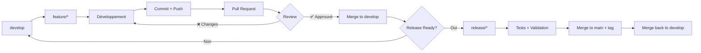

# Branching Strategy — Clawith Fork

**Version:** 1.0  
**Date:** 2026-03-24  
**Status:** ✅ Recommended  
**Approuvé par:** _En attente de validation Guillaume_

---

## 🎯 Recommended Structure

### **Option Choisie: B (Fork + Feature Branches)**

**Justification:**

Notre contexte unique nécessite un équilibre entre:
- **Préservation de notre valeur ajoutée** (37 commits: AgentMail, Infisical, Supergateway)
- **Intégration progressive** de l'upstream (621 commits de retard)
- **Sécurité de la production** (pas de breakage en direct sur main)
- **Collaboration d'équipe** (Guillaume + Upgrade Lead + MCP Lead)

---

## 🌿 Architecture des Branches

### Structure Globale

```
lesmoires/Clawith (GitHub)
│
├── main                  # 🟢 PRODUCTION - Stable, protégée
│   └── (tags: v1.0.0, v1.7.1, v1.7.2, etc.)
│
├── develop               # 🟡 STAGING - Intégration continue
│   │
│   ├── feature/upgrade-1.7.2
│   ├── feature/mcp-hetzner
│   ├── feature/agentmail-v2
│   ├── feature/infisical-mcp
│   └── hotfix/critical-security-fix
│
└── (branches temporaires)
    ├── release/v1.7.2
    └── experiment/*
```

### Description des Branches

| Branche | Purpose | Protection | Merge From | Merge To |
|---------|---------|------------|------------|----------|
| `main` | Production stable | 🔒 **Protégée** | `develop` (via PR) | — |
| `develop` | Intégration continue | ⚠️ Recommandée | `feature/*` (via PR) | `main` (via PR) |
| `feature/*` | Développement features | ❌ Non protégée | — | `develop` (via PR) |
| `hotfix/*` | Correctifs urgents | ❌ Non protégée | — | `main` + `develop` |
| `release/*` | Préparation release | ⚠️ Temporaire | `develop` | `main` + `develop` |

---

## 🔄 Workflow Détaillé

### Cycle de Vie d'une Feature



### 1. Créer une Feature Branch

```bash
# Depuis develop (toujours!)
git checkout develop
git pull origin develop

# Créer la branche
git checkout -b feature/nom-de-la-feature

# Exemples:
git checkout -b feature/upgrade-1.7.2
git checkout -b feature/mcp-hetzner
git checkout -b feature/agentmail-v2
```

**Convention de nommage:**
- `feature/<description>` — Nouvelles fonctionnalités
- `fix/<description>` — Corrections de bugs
- `hotfix/<description>` — Correctifs urgents prod
- `release/<version>` — Préparation release
- `experiment/<description>` — Tests/POC (peut être supprimé)

### 2. Développer + Committer

```bash
# Travailler normalement
git add .
git commit -m "feat: description concise"

# Push la première fois
git push -u origin feature/nom-de-la-feature

# Push suivants
git push
```

**Convention de commits:**
```
feat: Add AgentMail MCP integration
fix: Resolve WebSocket connection timeout
docs: Update BRANCHING_STRATEGY.md
chore: Update dependencies
test: Add unit tests for Infisical skill
```

### 3. Pull Request + Review

**Sur GitHub:**
1. Aller sur https://github.com/lesmoires/Clawith
2. Cliquer "Compare & pull request"
3. Remplir:
   - **Title:** `feat: Description concise`
   - **Description:** Ce qui a été fait, pourquoi, comment tester
   - **Reviewers:** Guillaume + lead concerné
   - **Labels:** `feature`, `mcp`, `agentmail`, etc.

**Checklist Review:**
- [ ] Code review par au moins 1 personne
- [ ] Tests passants (si applicables)
- [ ] Documentation mise à jour (si applicable)
- [ ] Pas de secrets/keys dans le code
- [ ] Compatible avec nos 37 commits existants

### 4. Merge to develop

Après approbation:
```bash
# Merge via GitHub UI (recommandé)
# OU en local:
git checkout develop
git pull origin develop
git merge --no-ff feature/nom-de-la-feature
git push origin develop
```

**Option `--no-ff`:** Préserve l'historique de la feature dans le graphe Git.

### 5. Release Process

Quand `develop` est stable pour une release:

```bash
# Créer branche de release
git checkout -b release/v1.7.2 develop

# Finaliser (version bump, changelog, etc.)
git commit -m "release: v1.7.2"

# Merge to main
git checkout main
git merge --no-ff release/v1.7.2
git tag -a v1.7.2 -m "Release v1.7.2"
git push origin main --tags

# Merge back to develop (pour sync)
git checkout develop
git merge --no-ff release/v1.7.2
git push origin develop

# Nettoyage
git branch -d release/v1.7.2
git push origin --delete release/v1.7.2
```

---

## 📥 Upstream Sync Strategy

### Contexte

Nous avons **621 commits de retard** sur `dataelement/Clawith` (upstream).  
Une fusion brutale casserait nos 37 commits uniques.

### Approche Progressive

#### Étape 1: Reconfigurer les remotes

```bash
cd /data/workspace/clawith-fork

# Renommer dataelement en upstream (plus logique)
git remote rename dataelement upstream

# Supprimer l'ancien upstream (openclaw/openclaw - trop divergent)
git remote remove upstream

# Nettoyer origin (enlever token embeddé!)
git remote set-url origin https://github.com/lesmoires/Clawith.git

# Vérifier
git remote -v
# upstream  https://github.com/dataelement/Clawith.git (fetch)
# upstream  https://github.com/dataelement/Clawith.git (push)
# origin    https://github.com/lesmoires/Clawith.git (fetch)
# origin    https://github.com/lesmoires/Clawith.git (push)
```

#### Étape 2: Sync progressif sur feature branch

```bash
# Créer branche d'upgrade
git checkout develop
git checkout -b feature/upgrade-1.7.2

# Fetch upstream
git fetch upstream

# Merge upstream/main (v1.7.2)
git merge upstream/main

# Résoudre les conflits (nos 37 commits vs upstream)
# Outils recommandés: VS Code, Meld, ou git mergetool

# Tester intensivement
# ...

# Push et PR
git push -u origin feature/upgrade-1.7.2
# → PR vers develop
```

#### Étape 3: Fréquence de Sync

| Type | Fréquence | Commande |
|------|-----------|----------|
| **Sync mineur** (develop) | Hebdomadaire | `git pull upstream main` |
| **Sync majeur** (release) | Mensuel | Via `feature/upgrade-*` |
| **Sync urgent** (security) | Immédiat | Via `hotfix/*` |

---

## 🔒 Branch Protection Rules

### Configuration GitHub (Settings → Branches)

#### `main` (Production)

```
✅ Require a pull request before merging
   ✅ Require approvals: 1
   ✅ Dismiss stale pull request approvals when new commits are pushed
   ✅ Require review from Code Owners

✅ Require status checks to pass before merging
   ✅ Search: CI / build
   ✅ Require branches to be up to date before merging

✅ Require conversation resolution before merging

✅ Include administrators  (personne n'est au-dessus des règles!)

✅ Restrict who can push to matching branches
   ✅ Guillaume (admin)
   ✅ Tech Lead (si désigné)
```

#### `develop` (Staging - Recommandé)

```
✅ Require a pull request before merging
   ✅ Require approvals: 1 (optionnel, selon équipe)

✅ Require status checks to pass before merging
   ✅ CI / build

⚠️ Ne PAS cocher "Include administrators" (besoin de flexibilité)
```

---

## 🚨 Gestion des Conflits

### Scénario: Nos 37 commits vs Upstream

**Problème:** Upstream a modifié les mêmes fichiers que nos features (AgentMail, Infisical, etc.)

**Solution:**

1. **Identifier les conflits:**
```bash
git checkout feature/upgrade-1.7.2
git merge upstream/main
# Git liste les conflits
```

2. **Résoudre avec stratégie:**
   - **Upstream a raison:** Accepter leurs changes
   - **Notre feature est unique:** Garder nos changes + adapter
   - **Les deux sont valables:** Fusionner intelligemment

3. **Outils recommandés:**
```bash
# VS Code (excellent pour les conflits)
code .

# Ou outil dédié
git mergetool  # Configure Meld, KDiff3, etc.

# Voir les diffs
git diff --conflict-diff-algorithm=histogram
```

4. **Tester après résolution:**
```bash
# Build
npm run build

# Tests
npm test

# Smoke test manuel
node dist/index.js --help
```

---

## 📊 Rollback Strategy

### Si quelque chose casse en prod

#### Option 1: Revert du dernier merge

```bash
# Sur main
git checkout main
git revert --no-edit <commit-hash>
git push origin main
```

#### Option 2: Reset to tag (cas extrême)

```bash
# ⚠️ DANGEREUX - Seulement si vraiment nécessaire
git checkout main
git reset --hard v1.7.1  # Tag précédent
git push --force origin main
```

#### Option 3: Hotfix branch

```bash
# Créer hotfix depuis dernier tag stable
git checkout -b hotfix/critical-fix v1.7.1

# Fix le problème
git commit -m "fix: Critical security patch"

# Merge to main + develop
git checkout main
git merge --no-ff hotfix/critical-fix
git tag -a v1.7.1-hotfix1 -m "Hotfix v1.7.1"
git push origin main --tags

git checkout develop
git merge --no-ff hotfix/critical-fix
git push origin develop
```

---

## 📝 Convention de Tags

### Tags de Release

```bash
# Release stable
git tag -a v1.7.2 -m "Release v1.7.2: AgentMail + Infisical integration"
git push origin v1.7.2

# Beta
git tag -a v2.0.0-beta1 -m "Beta 1: Major refactoring"
git push origin v2.0.0-beta1

# Hotfix
git tag -a v1.7.1-hotfix1 -m "Hotfix 1 for v1.7.1"
git push origin v1.7.1-hotfix1
```

### Format

- `v<MAJOR>.<MINOR>.<PATCH>` — SemVer
- `v<MAJOR>.<MINOR>.<PATCH>-beta<N>` — Beta releases
- `v<MAJOR>.<MINOR>.<PATCH>-hotfix<N>` — Hotfixes

---

## 👥 Rôles et Responsabilités

| Rôle | Permissions | Responsabilités |
|------|-------------|-----------------|
| **Guillaume** (Admin) | Push main, approve PRs | Validation finale, stratégie |
| **Upgrade Lead** | Push develop, approve PRs | Merge upstream, releases |
| **MCP Lead** | Push feature/*, create PRs | Features MCP, tests |
| **Contributeurs** | Push feature/* | Développement features |

---

## 📚 Documentation Associée

- `GIT_WORKFLOW_ANALYSIS_v1.md` — Analyse complète
- `REPO_ARCHITECTURE.md` — Structure des repos (à créer)
- `IMPLEMENTATION_GUIDE.md` — Guide pas-à-pas (à créer)
- `CONTRIBUTING.md` — À mettre à jour avec ce workflow

---

## ✅ Checklist d'Implémentation

### Semaine 1: Setup

- [ ] Nettoyer token GitHub dans remote origin
- [ ] Renommer `dataelement` → `upstream`
- [ ] Supprimer ancien `upstream` (openclaw/openclaw)
- [ ] Créer branche `develop`
- [ ] Configurer branch protection sur `main` (GitHub)
- [ ] Configurer branch protection sur `develop` (GitHub)

### Semaine 2-4: Upgrade v1.7.2

- [ ] Créer `feature/upgrade-1.7.2` depuis `develop`
- [ ] Fetch upstream
- [ ] Merge `upstream/main`
- [ ] Résoudre conflits (nos 37 commits)
- [ ] Tests intensifs
- [ ] PR → `develop` → review → merge
- [ ] Tag `v1.7.2` sur `main`

### Semaine 5+: Workflow Équipe

- [ ] Documenter dans `CONTRIBUTING.md`
- [ ] Former équipe (Guillaume + leads)
- [ ] Features futures sur `feature/*`
- [ ] Review process établi

---

**Prochaine étape:** Créer `REPO_ARCHITECTURE.md` et `IMPLEMENTATION_GUIDE.md`.
